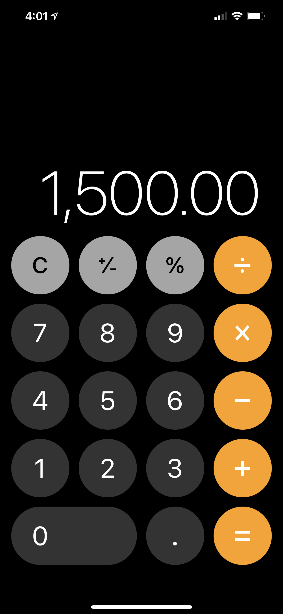

# Calculadora

Calculadora básica con funciones aritméticas de sumar, restar, multiplicar y dividir. Construida con [React Native](https://reactnative.dev/docs/getting-started).

# Tecnologías

- [React Native](https://reactnative.dev/docs/getting-started)
- [Typescipt](https://www.typescriptlang.org/)

## Resultado final

